# Absensi-Apps
Hai, saya Nurfauziah Makmur bisa dipanggil pausia berikut tentang panduan penggunaan sourch code aplikasi.

Aplikasi Absensi dengan Android Studio
Dimana ada 6 fiturnya yaitu:
1. Login
2. Absen Masuk
3. Absen Keluar
4. Perizinan
5. Riwayat Absensi
6. Logout

Dimana Sourche aslinya saya ambil pada channel youtube Azhar Rivaldi, berikut link videonya https://youtu.be/naA_RTzY9qA

# Tutorial Menggunakan Aplikasi
1. Unduh dulu file ini diatas entah itu langsung zip atau di git clone
2. Setelah unduh buka Android Studio 
3. Lalu pilih->Open project
4. Tunggu ngebuildnya
5. Hubungkan dulu ke firabase dengan cara ke-> Tools ->Firabase
->Autentication

->Autentication using google
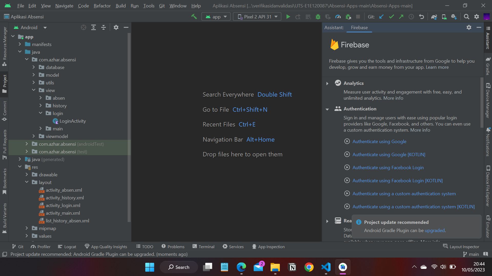
->Connect to firabase
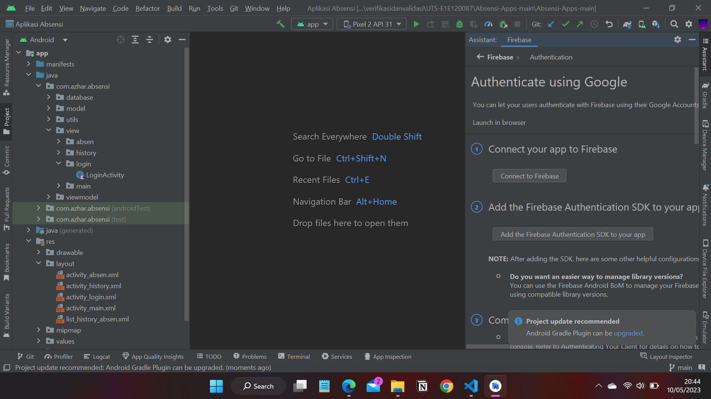
6. Setelah klik connect otomatis akan diarahkan di browser untuk membuat firabase database terlebih dahulu atau bisa menggunakan database lama, tapi saya sarankan buat baru.
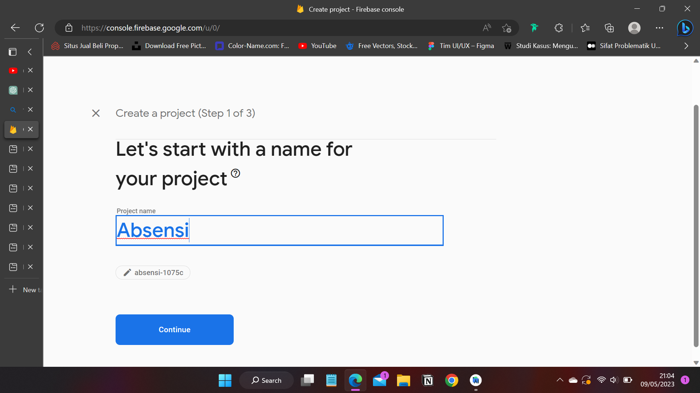
diklik enable lau create project
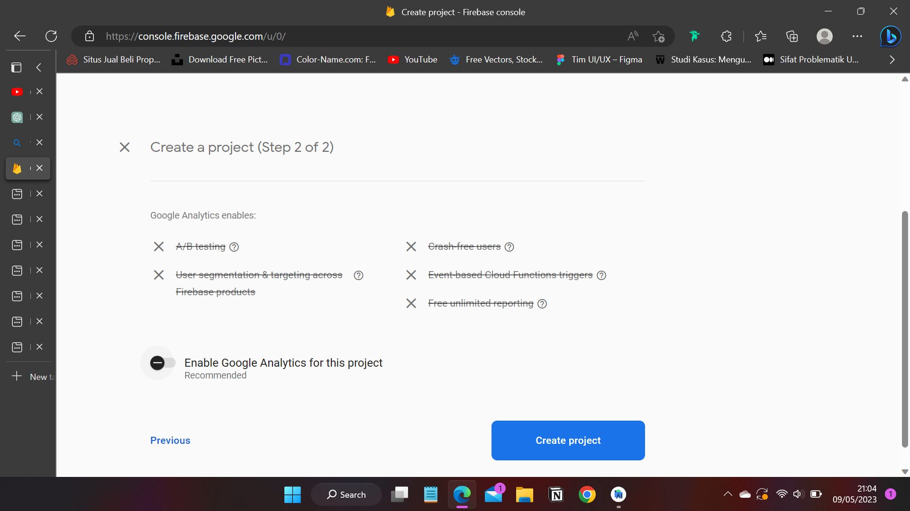
Tunggu prosess
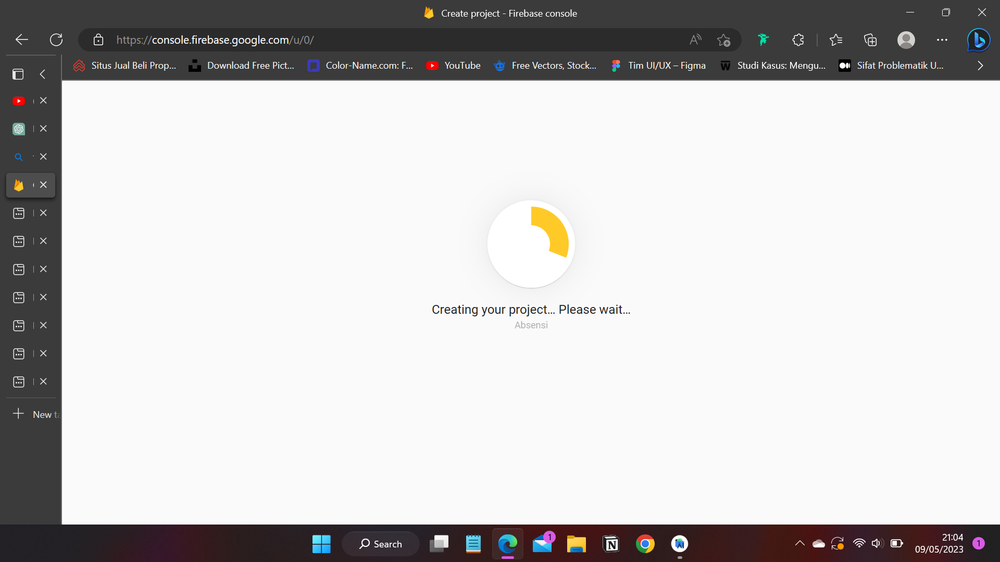
7. Setelah berhasil akan ada alert successfull dan didirect kehalaman menajemen database anda
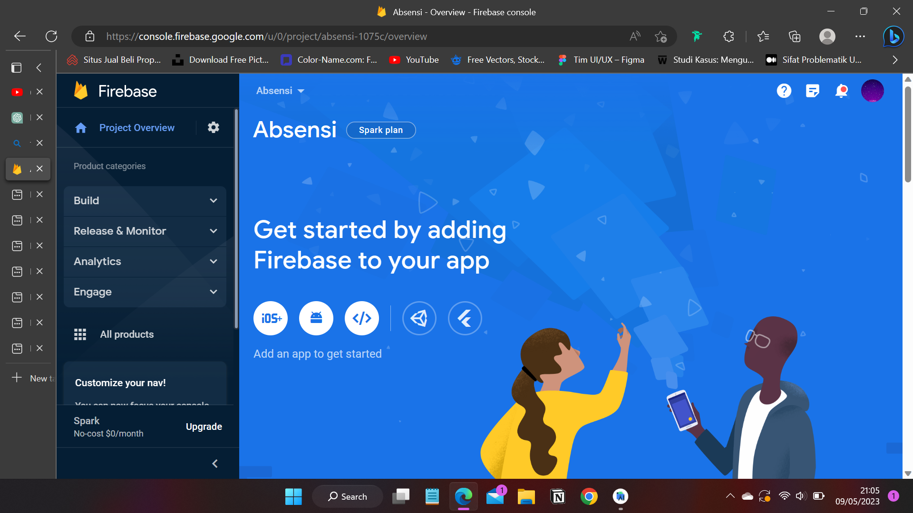
8. Nah setelah itu silahkan ke project overview (icon pengaturan diklik), lalu pilih project setting
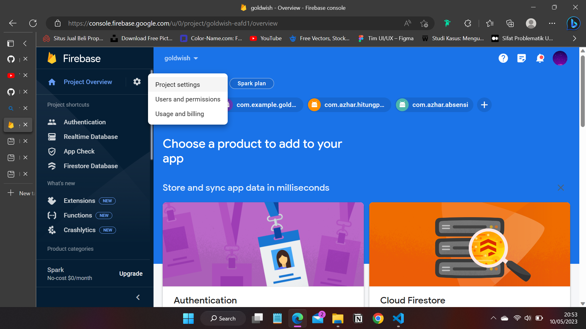
9. Setelah itu silahkan discroll kebawah hingga menemukan SDK Set and Configuration, nah disitu silahkan unduh/download file google-service-json.
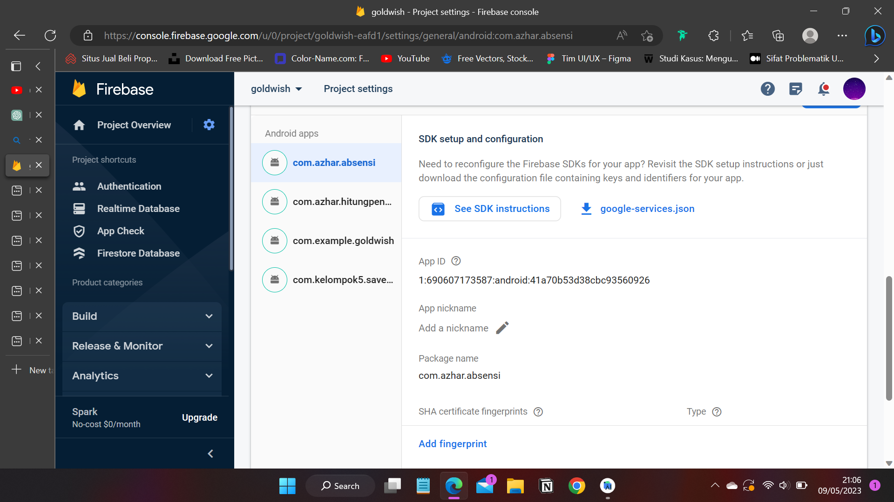
10. Lalu setelah diunduh, silahkan buka android studio kembali dan copy file yg telah didownload yaitu file google-service-json.
11. Lalu paste di project anda dibagian app, seperti gambar dibawah.
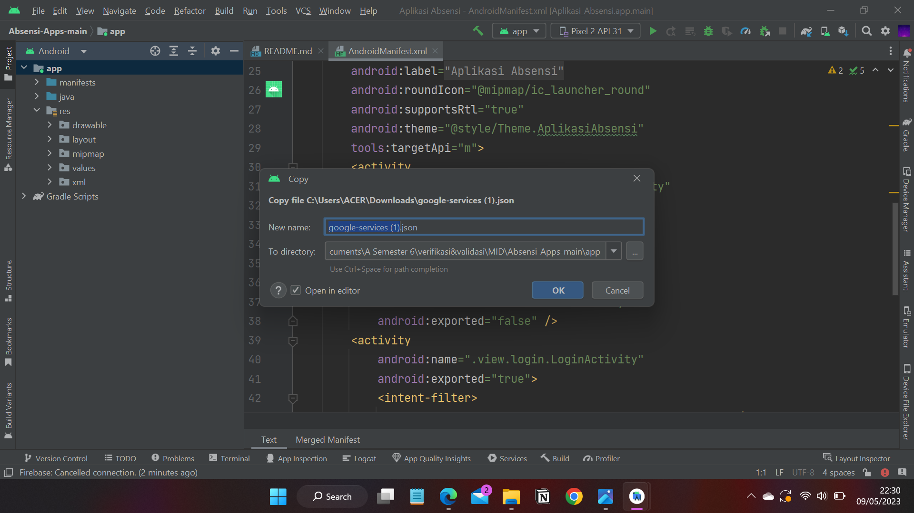
12. Ingat untuk menjalankannya harus konek ke internet dengan stabil dan jika ingin dijalankan di device henphone anda pastikan koneksi internet anda sudah terhubung dan juga aktifkan lokasi anda

# Tampilan Aplikasi
Nah berikut tampilan dari aplikasi
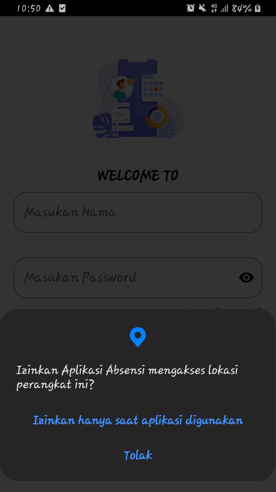
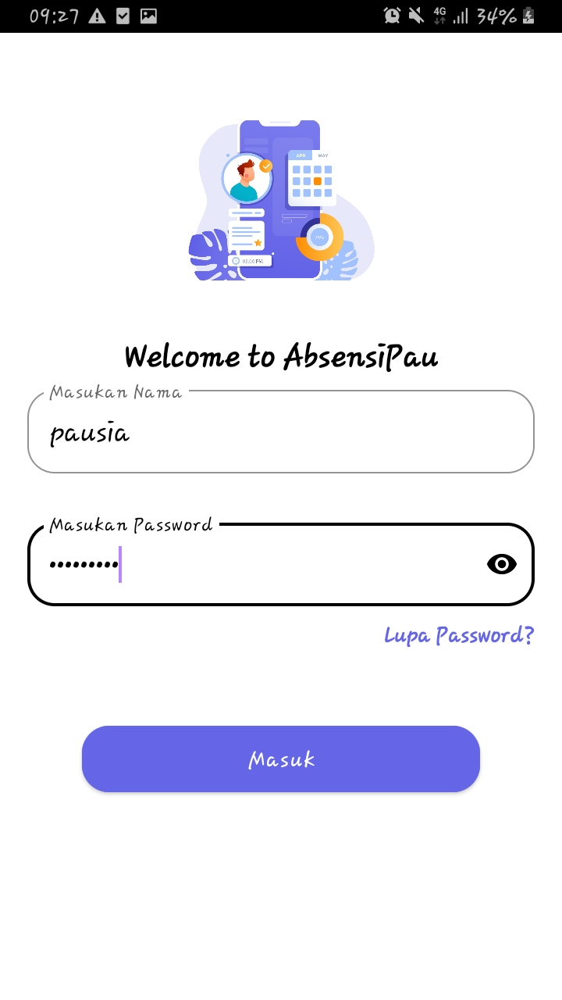
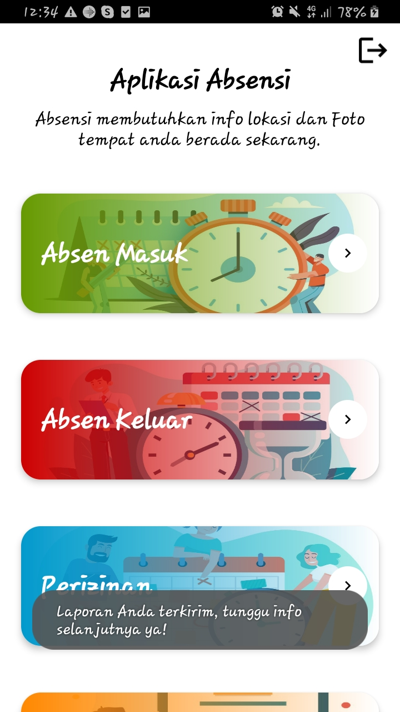
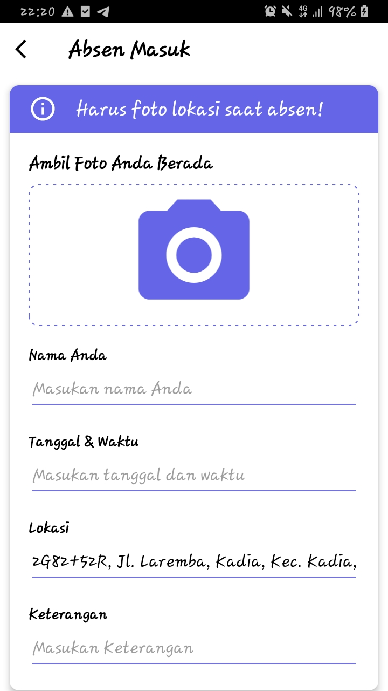
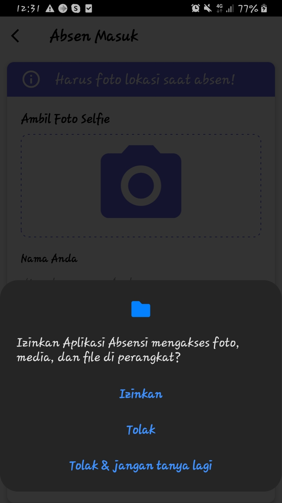
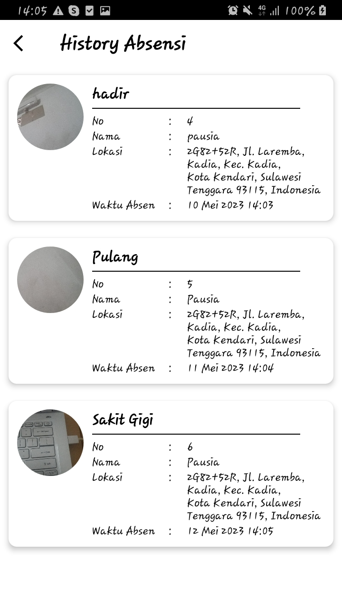
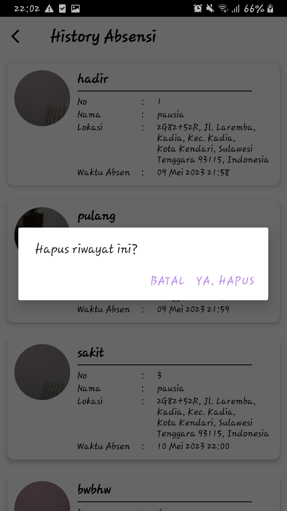


```
